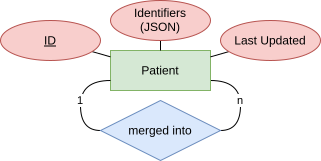
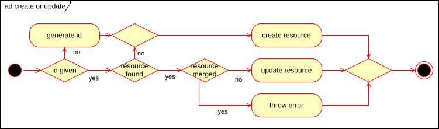
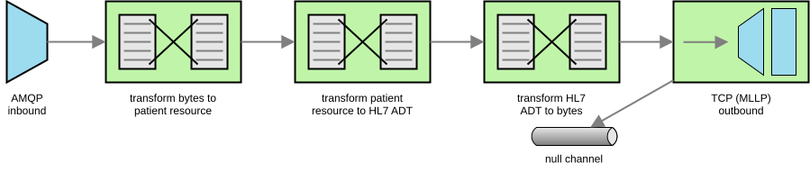

# Patient Index

Very, very, *very* limited patient indexing.

## Components

The *Patient Index* system is made of of three components:

* *Patient Index* Main, the actual index
* *Patient Index* Feed, an optional poller enabling IHE Patient Identity Feed (ITI-8) conformant messaging of new (or updated) or merged patient resources
* *Patient Index* Web Service, an optional web service enabling IHE PIXV3 Query (ITI-45) querying of patient resources

To fully work the system needs a PostgreSQL database and a RabbitMQ broker.


### Patient Index Main

The *Patient Index* Main component is a limited FHIR server. It only stores FHIR R5 Patient resources with their identifiers. Sending demographic data has no effect.



Check out the conformance statement for available methods and operations.



#### Configuration

The usual Spring Boot configuration applies (e.g. `server.port`).

This component sends patient updates to RabbitMQ by default (publishing to the `patient-index.resource` exchange), and fails if no broker is running. To disable set: `SPRING_AUTOCONFIGURE_EXCLUDE="org.springframework.boot.autoconfigure.amqp.RabbitAutoConfiguration"`

#### Development

The Main component uses JOOQ for code generation. If the patients table schema changes regenerate sources with maven using the specific profile:

```sh
mvn generate-sources -P jooq-codegen
```

The PostgreSQL database must be running for successful execution. The */compose-dev.yaml* Docker Compose file builds such database.

### Patient Index Feed

The *Patient Index* Feed component receives patient resources from RabbitMQ (subscribing to `patient-index.resource` via `patient-index-feed` queue) and generates HL7v2 ADT-A01 or -A40 messages depending on whether the resource has a `link` field or not. These messages are sent to a configured HL7 V2 receiver.



#### Configuration

The usual Spring configuration applies (e.g. `spring.rabbitmq.host`).

Additionally, following properties are required and have no defaults:

|Property|Description|Example|
|---|---|---|
|`patient-index.pid.namespace`|The namespace to be set in `PID-3` or `MRG-1`|`pid`|
|`patient-index.pid.oid`|The OID to be set in `PID-3` or `MRG-1`|`0.0.0`|
|`patient-index.feed.sender.application.namespace`|The namespace to be set in `MSH-3`|`app-s`|
|`patient-index.feed.sender.application.oid`|The OID to be set in `MSH-3`|`1.2.3`|
|`patient-index.feed.sender.facility.namespace`|The namespace to be set in `MSH-4`|`fac-s`|
|`patient-index.feed.sender.facility.oid`|The OID to be set in `MSH-4`|`4.5.6`|
|`patient-index.feed.receiver.application.namespace`|The namespace to be set in `MSH-5`|`app-r`|
|`patient-index.feed.receiver.application.oid`|The OID to be set in `MSH-5`|`7.8.9`|
|`patient-index.feed.receiver.facility.namespace`|The OID to be set in `MSH-6`|`fac-r`|
|`patient-index.feed.receiver.facility.oid`|The OID to be set in `MSH-6`|`10.11.12`|
|`patient-index.feed.receiver.host`|The message receiver hostname|`localhost`|
|`patient-index.feed.receiver.port`|The message receiver port|`6060`|
|`patient-index.feed.processing-mode`|The processing mode to be set in `MSH-11`, defaults to `T`|`P`|

#### Development

This component depends on `patient-index-commons`.

### Patient Index Web Service

The *Patient Index* Web Service queries the *Patient Index* on incoming requests.

While the *Patient Index* itself allows all kinds of identifier system URIs, this web service only recognizes systems of type OID (e.g. `urn:oid:0.0.0`). For FHIR Patient ids a system OID needs to be configured (`patient-index.pid.oid`).


#### Configuration

The usual Spring Boot configuration applies (e.g. `server.port`).

Additionally, the following properties are required and have no defaults:

|Property|Description|Example|
|---|---|---|
|`patient-index.fhir.server`|The FHIR base url to query patient resources|`http://localhost:8080/fhir/r5`|
|`patient-index.pid.oid`|The OID to be considered the patient resource id's OID|`0.0.0`|

#### WSDL

The *Patient Index* web service does not offer any WSDL itself. For developing consumers, please use the IHE-provided one and change the service url.

#### Development

To successfully compile the *Patient Index* web service place the *coreschemas* and *multicacheschemas* folders from the HL7v3 Normative Edition CD in */src/main/resources/schemas/hl7v3-ne2008/*

This component depends on `patient-index-commons`.

## Docker

To successfully run *compose.yaml* first run *build-docker.sh* to create the components' images, then place the [OpenTelemetry javaagent](https://github.com/open-telemetry/opentelemetry-java-instrumentation/releases) in */otel/opentelemetry-javaagent.jar* to run the services.
