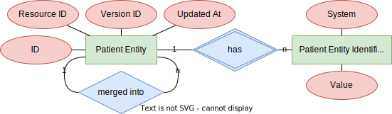

# Patient Index

Very, very, *very* limited patient indexing.

## Components

The *Patient Index* system is made of of three components:

* *Patient Index,* the actual index
* *Patient Index* Feed, an optional poller enabling IHE Patient Identity Feed (ITI-8) conformant messaging of new (or updated) or merged patient resources
* *Patient Index* Web Service, an optional web service enabling IHE PIXV3 Query (ITI-45) querying of patient resources

### Patient Index (Main Component)

The *Patient Index* is limited FHIR server. It only stores FHIR R5 Patient resources with their identifiers. Sending demographic data has no effect.

Check out the conformance statement for available methods and operations.

#### Configuration

The usual Spring Boot configuration applies (e.g. `server.port`).

### Patient Index Feed

The *Patient Index* Feed component polls the *Patient Index* regularly for updated patient resources and generates HL7v2 ADT-A01 or -A40 messages depending on whether the updated resource has a `link` field or not. These messages are queued to be sent to the given HL7v2 receiver.

#### Configuration

The following properties are required and have no defaults:

|Property|Description|Example|
|---|---|---|
|`patient-index-feed.fhir.server`|The FHIR base url to poll for patient resources|`http://localhost:8080/fhir/r5`|
|`patient-index-feed.hl7v2.pid.oid`|The OID to be set in `PID-3` or `MRG-1`|`0.0.0`|
|`patient-index-feed.hl7v2.sender.application.oid`|The OID to be set in `MSH-3`|`1.2.3`|
|`patient-index-feed.hl7v2.sender.facility.oid`|The OID to be set in `MSH-4`|`4.5.6`|
|`patient-index-feed.hl7v2.receiver.application.oid`|The OID to be set in `MSH-5`|`7.8.9`|
|`patient-index-feed.hl7v2.receiver.facility.oid`|The OID to be set in `MSH-6`|`10.11.11`|
|`patient-index-feed.hl7v2.server.host`|The message receiver hostname|`localhost`|
|`patient-index-feed.hl7v2.server.port`|The message receiver port|`6060`|

### Patient Index Web Service

The *Patient Index* Web Service queries the *Patient Index* on incoming requests.

While the *Patient Index* itself allows all kinds of identifier system URIs, this web service only recognizes systems of type OID (e.g. `urn:oid:0.0.0`). For FHIR Patient ids a system OID needs to be configured.

#### Configuration

The usual Spring Boot configuration applies (e.g. `server.port`).

Additionally, the following properties are required and have no defaults:

|Property|Description|Example|
|---|---|---|
|`patient-index-ws.fhir.server`|The FHIR base url to query patient resources|`http://localhost:8080/fhir/r5`|
|`patient-index-ws.hl7v3.pid.oid`|The OID to be considered the patient resource id's OID|`0.0.0`|

#### WSDL

The *Patient Index* web service does not offer any WSDL itself. Please use the IHE-provided one and change the service url.

#### Compilation

To successfully compile the *Patient Index* web service place the *coreschemas* and *multicacheschemas* folders from the HL7v3 Normative Edition CD in */src/main/resources/schemas/hl7v3-ne2008/*

## Docker Compose

To successfully run *compose.yaml* place the [OpenTelemetry javaagent](https://github.com/open-telemetry/opentelemetry-java-instrumentation/releases) in */otel/opentelemetry-javaagent.jar*
